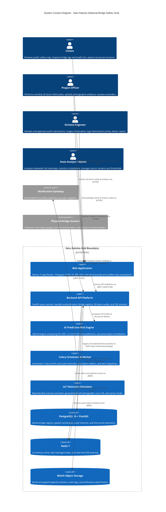

# Setu Raksha - System Architecture Context (C4 Model)

```mermaid
C4Context
    title System Context Diagram - Setu Raksha (National Bridge Safety Grid)

    Person(citizen, "Citizen", "Browses public safety map, inspects bridge age and health tier, reports structural concerns.")
    Person(officer, "Project Officer", "Performs monthly 26-factor field audits, uploads photographic evidence, receives reminders.")
    Person(engineer, "Division Engineer", "Reviews and approves audit submissions, triages critical alerts, logs interventions (close, divert, repair).")
    Person(admin, "State Analyst / Admin", "Analyzes statewide risk heatmaps, monitors compliance, manages sensor streams and thresholds.")

    Enterprise_Boundary(b0, "Setu Raksha Grid Boundary") {
        System(web, "Web Application", "Next.js 15 App Router. Trilingual UI (EN, HI, MR) with role-based portals and Leaflet map visualization.")
        System(api, "Backend API Platform", "FastAPI async service. Handles authentication, bridge registry, 26-factor audits, and SSE streams.")
        System(risk_engine, "AI Predictive Risk Engine", "Hybrid engine computing SVI, DRI, 12-month ML risk predictions, and prescriptive remediation.")
        System(worker, "Celery Scheduler & Worker", "Automates 7-day month-end audit reminders, escalation ladders, and alert dispatches.")
        System(simulator, "IoT Telemetry Simulator", "Reproducible scenario simulator generating flood hydrographs, scour tilt, and sensor faults.")

        SystemDb(postgres, "PostgreSQL 16 + PostGIS", "Stores bridge registry, spatial coordinates, audit histories, and time-series telemetry.")
        SystemDb(redis, "Redis 7", "In-memory cache, task message broker, and real-time SSE pub/sub.")
        SystemDb(minio, "MinIO Object Storage", "Stores encrypted inspection photos, crack logs, and verification attachments.")
    }

    System_Ext(mailpit, "Notification Gateway", "Email (SMTP) and SMS notification provider adapters.")
    System_Ext(sensors, "Physical Bridge Sensors", "Ultrasonic river water gauges, pier tilt inclinometers, and vibration accelerometers.")

    Rel(citizen, web, "Views bridge safety tiers & submits concerns via", "HTTPS")
    Rel(officer, web, "Submits 26-factor audits & evidence via", "HTTPS")
    Rel(engineer, web, "Acknowledges alerts & reviews audits via", "HTTPS")
    Rel(admin, web, "Monitors regional compliance via", "HTTPS")

    Rel(web, api, "Queries API endpoints via", "REST / JSON & SSE")
    Rel(api, postgres, "Reads/writes bridge & audit data via", "AsyncPG / SQLAlchemy")
    Rel(api, redis, "Caches data and publishes events to", "RESP")
    Rel(api, minio, "Issues presigned URLs for upload to", "S3 API")
    Rel(api, risk_engine, "Computes SVI & DRI via", "In-process Python")

    Rel(worker, redis, "Receives jobs & beat schedules from", "RESP")
    Rel(worker, mailpit, "Dispatches alert emails & SMS via", "SMTP / HTTP")
    Rel(simulator, api, "Ingests simulated telemetry batches to", "POST /api/v1/telemetry/readings")
    Rel(sensors, api, "Ingests real hardware sensor readings to", "POST /api/v1/telemetry/readings")
```
